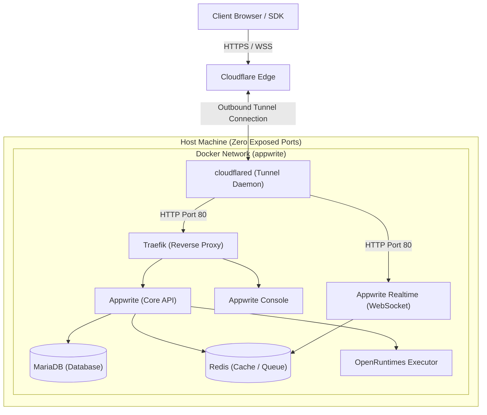

<p align="center">
  
  <br />
  &amp;
  <br />
  
</p>

<h1 align="center">Appwrite Self-Hosted with Cloudflare Tunnel</h1>

<p align="center">
  A complete, production-ready Appwrite backend infrastructure with secure Cloudflare Tunnel integration
</p>

<p align="center">
  <a href="https://github.com/rajjitlai/Appwrite-Self-Host-Cloudflare-Tunnel/stargazers">
    
  </a>
  <a href="https://github.com/rajjitlai/Appwrite-Self-Host-Cloudflare-Tunnel/issues">
    
  </a>
  <a href="https://github.com/rajjitlai/Appwrite-Self-Host-Cloudflare-Tunnel/blob/main/LICENSE">
    
  </a>
</p>

---

## 🏗️ Architecture Overview

This self-hosted Appwrite setup features:
- **Appwrite 1.9.0** - Backend-as-a-Service platform (with Realtime, Functions, and Console)
- **Traefik 3.6** - Edge reverse proxy and load balancer
- **MariaDB 10.11** - Core relational database
- **Redis 7.4.7-alpine** - High-performance cache and queue broker
- **Cloudflare Tunnel (`cloudflared`)** - Secure zero-trust access with zero inbound port exposure
- **Docker Compose** - Multi-container service orchestration

### Traffic Flow Diagram



---

## 🚀 Key Features

- ✅ **Zero Port Exposure**: Traefik binds strictly to local loopback interface (`127.0.0.1`), ensuring the machine is invisible to public port scanners.
- ✅ **Local Data Persistence**: All service databases, configurations, and cache files persist under the local `./data/` directory.
- ✅ **Portable Deployment**: The entire infrastructure is fully self-contained; zip the directory and move it to any Docker-capable machine in seconds.
- ✅ **Automatic Encryption Key Generation**: Setup scripts auto-generate cryptographically secure encryption keys for database and runtime executor security.
- ✅ **Built-in Background Workers**: Fully configured background queues for processing asynchronous audits, webhooks, scheduled tasks, and mail services.

---

## 📁 Directory Structure

```text
.
├── docker-compose.yml   # Multi-container service definitions
├── .env                 # Active environment variables (Git-ignored)
├── .env.example         # Template environment variables
├── .gitignore
├── LICENSE
├── Readme.md            # This file
├── setup.sh             # Configuration & directory creation script (Linux/macOS)
├── setup.bat            # Configuration & directory creation script (Windows)
├── cloudflared/         # Cloudflare Tunnel configuration directory
│   ├── config.yml       # Ingress rules and routing settings
│   ├── logs/            # Runtime logs for the tunnel agent (Git-ignored)
│   └── *.json           # Tunnel credentials JSON file (Git-ignored)
└── data/                # Persistent volumes directory (Git-ignored)
    ├── mariadb/         # MySQL relational database storage
    ├── redis/           # Redis cache and queue database storage
    ├── uploads/         # User files, avatars, and storage buckets
    ├── cache/           # Internal caching files
    ├── config/          # Traefik configuration files
    ├── certificates/    # SSL certificates cache
    ├── functions/       # Appwrite Functions source code and runtimes
    ├── sites/           # Appwrite Web Hosting static assets
    ├── builds/          # Compiled function builds
    └── imports/         # Backup import/export temporary folder
```

---

## ⚡ Quick Start

### 1. Clone the Repository
```bash
git clone https://github.com/rajjitlai/Appwrite-Self-Host-Cloudflare-Tunnel.git
cd Appwrite-Self-Host-Cloudflare-Tunnel
```

### 2. Run the Initialization Script
Run the script suitable for your operating system. This script will create the necessary `./data/` and `./cloudflared/logs/` directories, copy `.env.example` to `.env`, and generate secure encryption keys for `_APP_OPENSSL_KEY_V1` and `_APP_EXECUTOR_SECRET`.

* **Linux / macOS**:
  ```bash
  chmod +x setup.sh
  ./setup.sh
  ```
* **Windows (PowerShell/CMD)**:
  ```cmd
  setup.bat
  ```

### 3. Customize Your Environment Variables
Open the generated `.env` file and verify or update:
- `_APP_DOMAIN`: Set this to your primary domain (e.g. `yourdomain.com`).
- `_APP_DOMAIN_FUNCTIONS`: Set to `functions.yourdomain.com`.
- `_APP_DOMAIN_SITES`: Set to `sites.yourdomain.com`.
- Database credentials and other optional settings (e.g., SMTP configurations).

### 4. Deploy the Containers
Start the core services in detached mode:
```bash
docker-compose up -d
```

### 5. Run Database Migrations
Run the Appwrite database migration command to set up tables, collections, and indexes:
```bash
docker-compose exec appwrite migrate
```

### 6. Verify System Health
Verify your installation is fully functional with the built-in diagnostic tool:
```bash
docker-compose exec appwrite doctor
```

---

## 🔒 Security & Port Hardening

To prevent public ingress and external scans, the Traefik ports in `docker-compose.yml` are restricted to local loopback bindings:

```yaml
    ports:
      - 127.0.0.1:80:80
      - 127.0.0.1:443:443
```

> [!IMPORTANT]
> Because Traefik only listens on `127.0.0.1`, Appwrite will **not** be directly accessible from the internet via your public IP address. All remote traffic must pass securely through the Cloudflare Tunnel.

---

## ☁️ Cloudflare Tunnel Setup

1. **Create a Tunnel**:
   - Go to your [Cloudflare Zero Trust Dashboard](https://one.dash.cloudflare.com).
   - Navigate to **Networks** -> **Tunnels** and click **Create a Tunnel**.
   - Select `cloudflared` as the connector, name your tunnel (e.g. `appwrite-tunnel`), and save.

2. **Save Credentials**:
   - Copy the Tunnel ID and download your tunnel credentials JSON file.
   - Place this credentials file in the `./cloudflared` directory and rename it to `<your-tunnel-id>.json` (e.g., `1a2b3c4d-5e6f-7a8b-9c0d-1e2f3a4b5c6d.json`).

3. **Configure Ingress Rules**:
   - Open `cloudflared/config.yml` and replace `your-tunnel-id` and `your-domain.com` with your actual values:
     ```yaml
     tunnel: 1a2b3c4d-5e6f-7a8b-9c0d-1e2f3a4b5c6d
     credentials-file: /etc/cloudflared/1a2b3c4d-5e6f-7a8b-9c0d-1e2f3a4b5c6d.json
     logfile: /etc/cloudflared/logs/cloudflared.log
     loglevel: info

     ingress:
       - hostname: your-domain.com
         service: http://traefik:80
       - hostname: '*.sites.your-domain.com'
         service: http://traefik:80
       - hostname: realtime.your-domain.com
         service: http://appwrite-realtime:80
       - service: http_status:404
     ```

4. **Enable cloudflared Service**:
   - Open `docker-compose.yml`, scroll to the bottom, and uncomment the `cloudflared` service block.

5. **Restart Infrastructure**:
   - Restart docker-compose to launch the tunnel agent:
     ```bash
     docker-compose down
     docker-compose up -d
     ```

6. **Add CNAME Records in Cloudflare DNS**:
   - Add CNAME records pointing to your tunnel hostname (`<your-tunnel-id>.cfargotunnel.com`):
     - `@` (root domain) -> Points to `<your-tunnel-id>.cfargotunnel.com`
     - `realtime` -> Points to `<your-tunnel-id>.cfargotunnel.com`
     - `*.sites` (wildcard) -> Points to `<your-tunnel-id>.cfargotunnel.com`

---

## 💾 Storage & Maintenance

### Managing Docker Disk Space
Docker on your host machine can consume significant storage over time due to unused image layers, log accumulation, and dangling volumes:

1. Clean up unused builder cache, containers, and networks:
   ```bash
   docker system prune -a
   ```
2. Clean unused volumes (⚠️ Warning: This will delete unused persistent data):
   ```bash
   docker volume prune
   ```
3. Check overall disk usage:
   ```bash
   docker system df
   ```

---

## 🔧 Troubleshooting

### 🔄 Redirect Loop (`ERR_TOO_MANY_REDIRECTS`)
* **Problem**: Browsers throw a redirect loop error when trying to load the console.
* **Cause**: Appwrite is trying to force HTTPS redirect locally while Cloudflare Tunnel is relaying unencrypted traffic to Traefik on port 80.
* **Solution**:
  1. Open `.env` and set:
     ```env
     _APP_OPTIONS_FORCE_HTTPS=disabled
     _APP_OPTIONS_ROUTER_FORCE_HTTPS=disabled
     _APP_OPTIONS_FUNCTIONS_FORCE_HTTPS=disabled
     ```
  2. On your Cloudflare Dashboard, go to **SSL/TLS** -> **Overview** and set the encryption mode to **Flexible** (or **Full** if Traefik handles custom certificates).
  3. Turn on **Always Use HTTPS** in Cloudflare **SSL/TLS** -> **Edge Certificates**.

### ❌ Realtime Connection Closes Immediately
* **Problem**: WebSocket subscriptions fail or drop instantly.
* **Solution**:
  1. Verify the CNAME `realtime` is correctly configured in your Cloudflare DNS settings.
  2. Ensure WebSocket connections are enabled in the Cloudflare Dashboard under **Network** -> **WebSockets** (set to Enabled).

---

## 📄 License

This project is licensed under the MIT License - see the [LICENSE](LICENSE) file for details.

## 📚 Additional Resources

- [Appwrite Self-Hosting Installation Guide](https://appwrite.io/docs/advanced/self-hosting/installation)
- [Appwrite Official Documentation](https://appwrite.io/docs)
