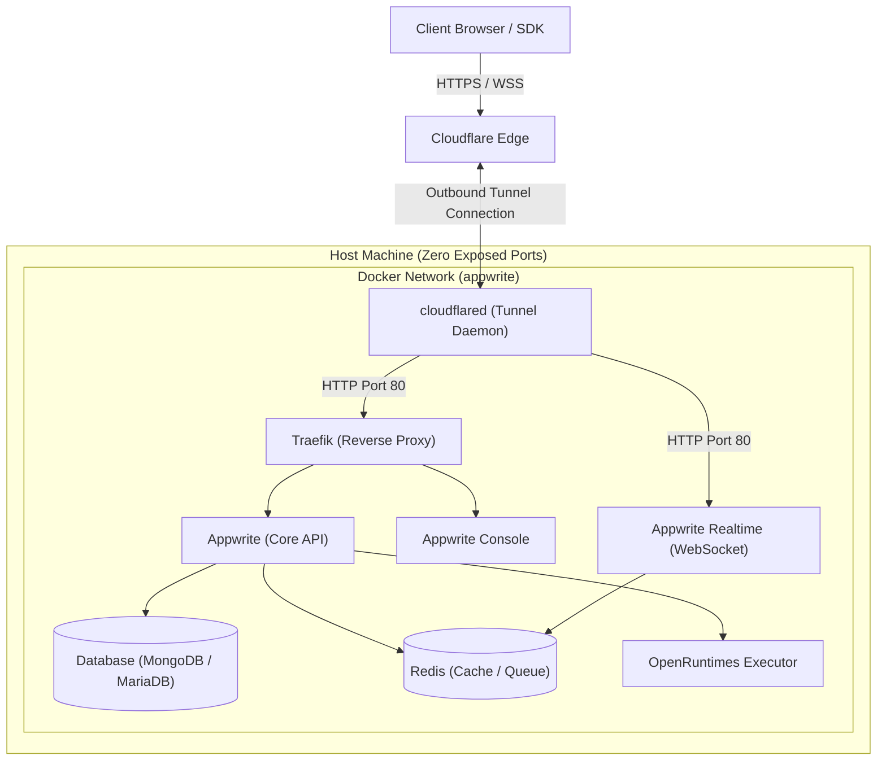

# Appwrite Self-Hosted with Cloudflare Tunnel

A complete, production-ready Appwrite backend infrastructure setup with secure Cloudflare Tunnel integration.


This repository offers two configurations for hosting Appwrite:
1. **`default-mongodb` (Default Setup)**: Appwrite 1.9.0's official default setup utilizing **MongoDB (v8.2)** as the database backend. It runs out of the box using Docker-managed named volumes.
2. **`custom-mariadb` (Custom Setup)**: A database configuration utilizing **MariaDB (v10.11)** as the database backend. It runs using Docker-managed named volumes and includes a pre-configured database healthcheck.

Both setups bind Traefik strictly to the local loopback interface (`127.0.0.1`), ensuring zero inbound ports are exposed to the public internet. All traffic is routed securely via a Cloudflare Tunnel.

---

## 🏗️ Architecture Overview



---

## 📁 Repository Structure

```text
.
├── custom-mariadb/                # MariaDB database setup
│   ├── docker-compose.yml         # Compose config with MariaDB + Cloudflare Tunnel
│   ├── .env.example               # Template environment variables
│   ├── setup.sh                   # Initialization script (Linux/macOS)
│   ├── setup.bat                  # Initialization script (Windows)
│   └── cloudflared/               # Cloudflare Tunnel config directory
│       ├── config.yml             # Ingress rules and routing settings
│       └── your-tunnel-id.json    # Credentials placeholder file
│
├── default-mongodb/               # MongoDB database setup (Default in 1.9.0)
│   ├── Default.md                 # Setup command reference
│   ├── docker-compose.yml         # Compose config with MongoDB + Cloudflare Tunnel
│   ├── .env.example               # Template environment variables
│   ├── setup.sh                   # Initialization script (Linux/macOS)
│   ├── setup.bat                  # Initialization script (Windows)
│   └── cloudflared/               # Cloudflare Tunnel config directory
│       ├── config.yml             # Ingress rules and routing settings
│       └── your-tunnel-id.json    # Credentials placeholder file
│
├── Readme.md                      # This file
└── LICENSE
```

---

## ⚡ Quick Start

Choose the setup you wish to deploy (`default-mongodb` or `custom-mariadb`) and follow the steps below:

### 1. Navigate to the Directory
```bash
# For MongoDB setup:
cd default-mongodb

# OR for MariaDB setup:
cd custom-mariadb
```

### 2. Run the Initialization Script
Run the script suitable for your operating system inside the chosen folder. This script copies `.env.example` to `.env`, generates secure encryption keys for `_APP_OPENSSL_KEY_V1` and `_APP_EXECUTOR_SECRET`, and sets up the necessary log files.

* **Linux / macOS**:
  ```bash
  chmod +x setup.sh
  ./setup.sh
  ```
* **Windows (PowerShell/CMD)**:
  ```cmd
  setup.bat
  ```

### 3. Configure cloudflared
1. Create a tunnel in your **Cloudflare Zero Trust Dashboard** (under Networks -> Tunnels).
2. Save your downloaded credentials JSON file as `cloudflared/<your-tunnel-id>.json`.
3. Open `cloudflared/config.yml` and replace:
   - `your-tunnel-id` with your actual Tunnel ID.
   - `your-domain.com` with your actual custom domain.

### 4. Deploy the Containers
Start the core services in detached mode:
```bash
docker compose up -d
```

### 5. Run Database Migrations
If using MariaDB or initializing for the first time, run the migrations:
```bash
docker compose exec appwrite migrate
```

### 6. Verify System Health
Verify your installation is fully functional with the built-in diagnostic tool:
```bash
docker compose exec appwrite doctor
```

---

## 🔒 Security & Port Hardening

To prevent public ingress and external scans, the Traefik ports in `docker-compose.yml` are restricted to local loopback bindings:

```yaml
    ports:
      - 127.0.0.1:80:80
      - 127.0.0.1:443:443
```

> [!IMPORTANT]
> Because Traefik only listens on `127.0.0.1`, Appwrite will **not** be directly accessible from the internet via your public IP address. All remote traffic must pass securely through the Cloudflare Tunnel.

---

## 🔧 Troubleshooting

### 🔄 Redirect Loop (`ERR_TOO_MANY_REDIRECTS`)
* **Problem**: Browsers throw a redirect loop error when trying to load the console.
* **Cause**: Appwrite is trying to force HTTPS redirect locally while Cloudflare Tunnel is relaying unencrypted traffic to Traefik on port 80.
* **Solution**:
  1. Open `.env` and set:
     ```env
     _APP_OPTIONS_FORCE_HTTPS=disabled
     _APP_OPTIONS_ROUTER_FORCE_HTTPS=disabled
     _APP_OPTIONS_FUNCTIONS_FORCE_HTTPS=disabled
     ```
  2. On your Cloudflare Dashboard, go to **SSL/TLS** -> **Overview** and set the encryption mode to **Flexible** (or **Full** if Traefik handles custom certificates).
  3. Turn on **Always Use HTTPS** in Cloudflare **SSL/TLS** -> **Edge Certificates**.

### ❌ Realtime Connection Closes Immediately
* **Problem**: WebSocket subscriptions fail or drop instantly.
* **Solution**:
  1. Verify the CNAME `realtime` is correctly configured in your Cloudflare DNS settings.
  2. Ensure WebSocket connections are enabled in the Cloudflare Dashboard under **Network** -> **WebSockets** (set to Enabled).
